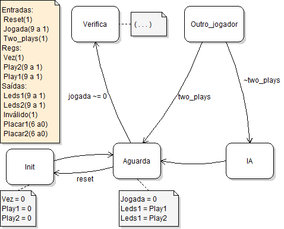
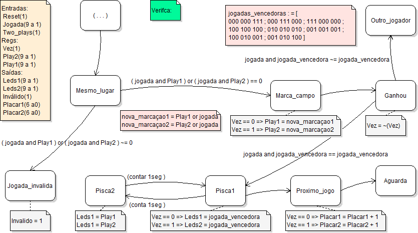

Jogo da Velha em FPGA com matriz de leds e pushbuttons 3x3

Código fonte + testbench
Linguagem: VHDL
Algoritmo: High Level FSM - modelo Moore
FPGA: Spartan 3 xc3s200-4ft256
Ambiente: Xilinx ISE 14

